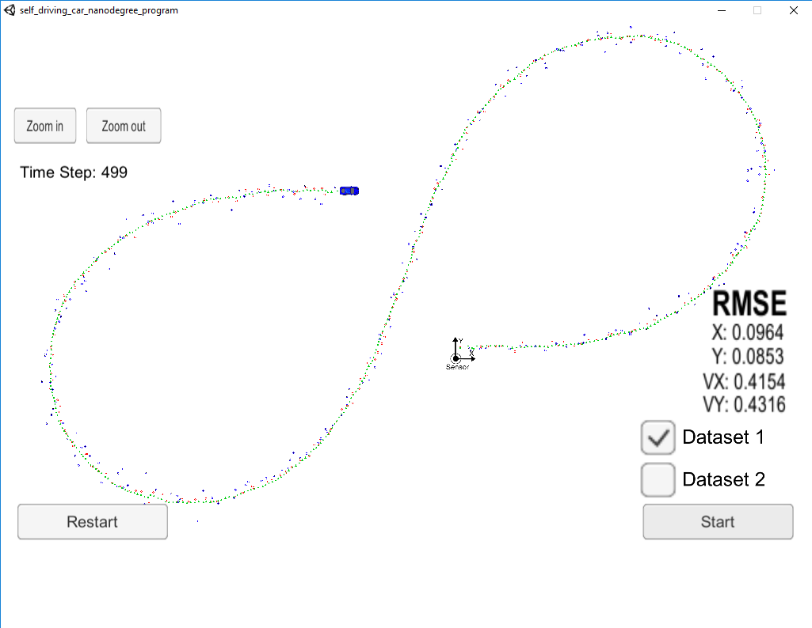
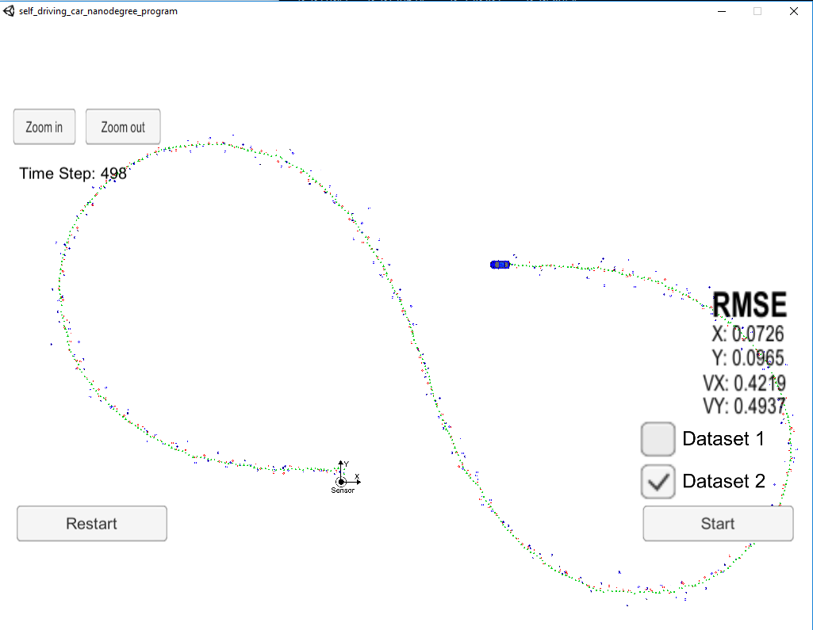

# CarND-Extended-Kalman-Filter-P1
Udacity Self-Driving Car Nanodegree - Extended Kalman Filter Implementation

# Overview
This project consists of implementing an [Extended Kalman Filter](https://en.wikipedia.org/wiki/Extended_Kalman_filter) with C++. A simulator provided by Udacity generates noisy RADAR and LIDAR measurements of the position and velocity of an object, and the Extended Kalman Filter[EKF] must fusion those measurements to predict the position of the object. The communication between the simulator and the EKF is done using [WebSocket](https://en.wikipedia.org/wiki/WebSocket) using the [uWebSockets](https://github.com/uNetworking/uWebSockets) implementation on the EKF side.


# Prerequisites

The project has the following dependencies (from Udacity's seed project):

- cmake >= 3.5
- make >= 4.1
- gcc/g++ >= 5.4
- Udacity's simulator.

For instructions on how to install these components on different operating systems, please, visit [Udacity's seed project](https://github.com/udacity/CarND-Extended-Kalman-Filter-Project). 


# Compiling and executing the project

These are the suggested steps:

- Clone the repo and cd to it on a Terminal.
- Create the build directory: `mkdir build`
- `cd build`
- `cmake ..`
- `make`: This will create the following executable
  - `ExtendedKF` : EKF implementation.

## Running the Filter

From the build directory, execute `./ExtendedKF`. The output should be:

```
Listening to port 4567
Connected!!!
```

The simulator connect to it right away.

The simulator provides two datasets. The difference between them are:

- The direction the car (the object) is moving.
- The order the first measurement is sent to the EKF. On dataset 1, the LIDAR measurement is sent first. On the dataset 2, the RADAR measurement is sent first.

Here is the simulator final state after running the EKF with dataset 1:



Here is the simulator final state after running the EKF with dataset 2:



# [Rubric](https://review.udacity.com/#!/rubrics/748/view) points

## Compiling

### Your code should compile

The code compiles without errors. 

## Accuracy

### px, py, vx, vy output coordinates must have an RMSE <= [.11, .11, 0.52, 0.52] when using the file: "obj_pose-laser-radar-synthetic-input.txt which is the same data file the simulator uses for Dataset 1"

The EKF accuracy was:

- Dataset 1 : RMSE <= [0.0964, 0.0853, 0.4154, 0.4316]
- Dataset 2 : RMSE <= [0.0726, 0.0965, 0.4216, 0.4932]

The EKF can be modified to use either RADAR or LIDAR data also. To do that we have to uncomment either line 65-67 or 68-70 in [src/FusionEKF.cpp](./src/FusionEKF.cpp#L65)

The EKF accuracy with only LIDAR data was:

- Dataset 1 : RMSE <= [0.1838, 0.1542, 0.5748, 0.4893]
- Dataset 2 : RMSE <= [0.1673, 0.1567, 0.6566, 0.5001]

The EKF accuracy with only RADAR data was:

- Dataset 1 : RMSE <= [0.2310, 0.3355, 0.5076, 0.7001]
- Dataset 2 : RMSE <= [0.2439, 0.3375, 0.6035, 0.8174]

## Following the Correct Algorithm

### Your Sensor Fusion algorithm follows the general processing flow as taught in the preceding lessons.

The Kalman filter implementation can be found [src/kalman_filter.cpp](./src/kalman_filter.cpp) and it is used to predict at [src/FusionEKF.cpp](./src/FusionEKF.cpp#L149) line 149 and to update line 160 to 175.

### Your Kalman Filter algorithm handles the first measurements appropriately.

The first measurement is handled at [src/FusionEKF.cpp](./src/kalman_filter.cpp#L61) from line 84 to line 112.

### Your Kalman Filter algorithm first predicts then updates.

The predict operation could be found at [src/FusionEKF.cpp](./src/kalman_filter.cpp#L147) line 149 and the update operation from line 160 to 175 of the same file.

### Your Kalman Filter can handle radar and lidar measurements.

Different type of measurements are handled in two places in [src/FusionEKF.cpp](./src/kalman_filter.cpp):

## Code Efficiency

### Your algorithm should avoid unnecessary calculations.

An example of this calculation optimization is when the Q matrix is calculated [src/FusionEKF.cpp](./src/kalman_filter.cpp#L141) line 134 to line 147.

